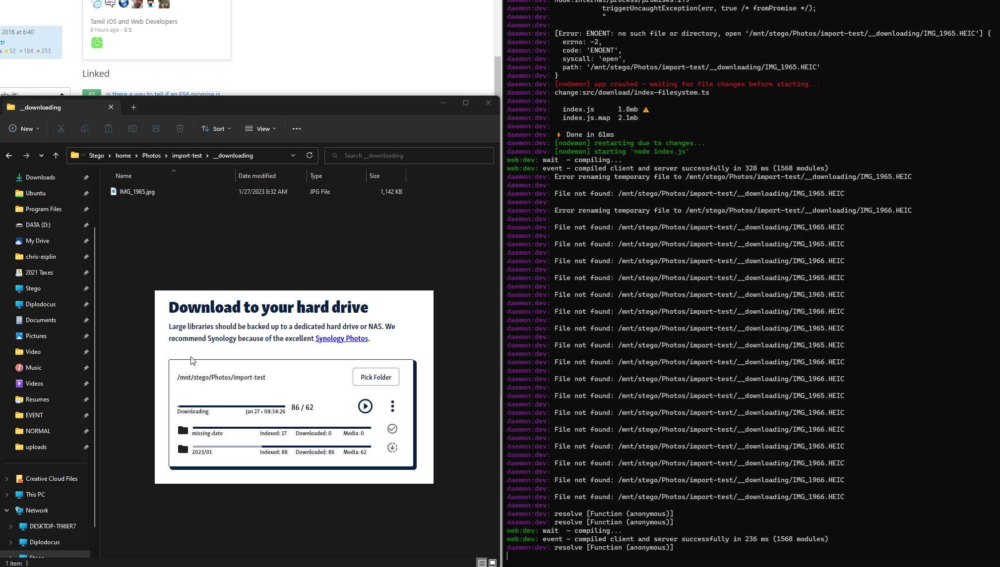

## January 25, 2024

I'm so frustrated with the current state of this application. I'm equally frustrated with Google Takeout.

I want to be working on other things, but this project keeps calling me back.

Folks have been subscribing to photos.chrisesplin.com, and they've been emailing me for support... because the process I designed is buggy and difficult.

It works... but it's a pain in the neck, and even technical folks get frustrated by it. The issues are fundamental to the design. The Google Photos API isn't powerful enough to make this tool work smoothly.

So here we are. I'm seriously considering a full rewrite, probably as as Wails app in golang.

But before I do that, I need to absolutely guarantee that Google Takeout is dropping data. I'll have to write some analysis tools to do that. It's not straightforward at all.

## April 6, 2023

Today is Thursday, and I put my two weeks in on Monday.

Healey and Steve both expressed great surprise.

Healey should've known. I put up a good front for Steve, so I guess it makes sense that he'd be surprised??? 

Months of dealing with Steve just put me over the edge. I can't do this any longer. And the insane dilution from Healey's fundraising sure doesn't help!

I'm setting up my A/V for Highlight. I need to get a clean YT screencast setup. I bought an old Lumix G7 camera from Jordan Gibby. He hooked me up. He has too many cameras. Now I need to build a wall-mounted rig to suspend the camera, a mic and a light just above the edge of my computer monitor.

The snow kept falling until yesterday afternoon when we had a merciful melt-off. The sheer volume of snow in our yard is making shoveling and snow blowing pretty difficult. The mounds on each side of the driveway are 10ft tall. I can barely throw snow over them.

## March 31, 2023

It's been an eventful few days.

I got two job offers, one from Highlight and another from Royal.

Each job represented a very different career direction for me. I'm going with Highlight, because I get to do a mix of front- and back-end dev, I get to learn Go, and I'll be doing a bit of DevRel-style work like I used to do with Firebase.

Royal would've been fun just because I'd be working with Dan Neighman and Sonny Scroggins again. The rest of the team was great too. But I couldn't get my head around the Royal business model. They raised boatloads of cash during the NFT craze, had to pivot away from NFTs as the hype died off, and now they're searching for their market again. I've been dealing with a foreign business model at BoomPop for the last 9 months, and I need a break from working on business models that I can't understand.

Highlight will be a big, hairy transition for me. But it'll stretch me in new directions and force me to learn and grow again in a way that I haven't these last two years.

It's been snowing like crazy, so I bought a motorcycle. I got a Yamaha Blue, 2023 XSR 900. I've been ogling it since the press launch in late 2021, and I put a deposit down and got on a waitlist at MotoUnited on a bit of a whim. Then, after driving home with Melissa, I figured I'd check web inventory at Karl Malone Powersports SLC. And sure enough! Karl Malone had TWO 900's in stock. One was built on the floor. I messaged them, confirmed that it was there—on the floor!!!—and went down the next day to buy it.

Melissa would have preferred that I'd purchased the CB650R that was sitting across the floor from the XSR. The CB is a pretty little thing, but it's only 90HP, and I wanted the bigger step up in power to 117HP with the XSR. Melissa can buy the CB when she's done with my XSR 700.

I held firm on the price! I got a $200 discount for writing a full check and letting them book the sale for March. It was a very slow month with all of the snow. I also insisted that they take the ETCH fee off, so I saved another $200. The total was ~$12,850. It's a big check to write, but Melissa and I will both love it. We'll sell the CB300R ASAP and offset that around $4k??

Quiver Photos (this project's new name) is finally working on MacOS. It was so depressing when I booted it up on Melissa's iMac and it barfed all over the screen. I had to run back to my computer and write a ton of new error-handling logic. Once I had a handle on the error, I had to figure out that MacOS treats `process.cwd()` differently depending on how you launch the process. Long-story-short... I figured it out in about an hour.

The app's getting much more stable. I figured out how to sign the Windows binary. I don't think I'll sign the Linux binary, because Linux users are already used to running weird scripts on their machines. I'll need to sign the MacOS binary as soon as it's stable. Apple's signing process appears to be unwieldy, although I'll have to dig deeper once I'm ready.

All in all... it's been a great couple of weeks. Interviewing sucks. It distracts from all of the actual work that I want to get done. It makes keeping up with BoomPop that much harder. But I'm excited to turn the page, let BoomPop ride off into the sunset in capable hands, and plot my next moves.

My intention is to put a bow on Quiver Photos in the next month or two. I'd like to get it pay-walled, write some juicy SEO content, get basic paid marketing in place, sit back and see if it hits. It probably won't hit. And I'll probably be dreaming up another side hustle this fall. But there's only one way to find out!

## March 14, 2023

Yesterday afternoon I YOLOed $3000 on First Republic Bank and Pacific Western Bank.

This is against my character, but the news coverage of the SVB bank run was so abhorrent that I wanted to profit from it. This SVB stuff is so specific to them. There's no reason that FRB and PACW should get lumped in with SVB.

I was down $500 for a while yesterday afternoon, but at open this morning both stocks ripped. I have limit orders in to sell when they hit a certain point. I'm hoping to 1.5X my money. I could probably hold on for a full recovery... but my other thesis is that the entire market is getting ready to tank, because inflation is not going away and JPow will stay on the warpath for another year.

In even cooler news, I just got an email from someone who's been following my r/google-photos posts and discovered photos.chrisesplin.com. He ran into a bug that I'd hoped was just in dev... but clearly it's a real issue. So I'll have to get on that ASAP. I'm on the cusp of providing real value!

I've been on a real upswing the last couple of weeks.

True Grit went great over the weekend. It started out pouring rain. Absolutely pouring. But then it dried out and back 2/3's of the course ran fast.

Melissa finished under 6:30 and I finished at 5:00. I know I could have done it faster if I weren't so out-of-practice with the rock riding. I was getting as sendy as I could, but those cliffs are collarbone assassins. I do not want to join the Collarbone Club, and with my iffy handling skills, I got close a couple of times.

I also got our shower panel replaced. The dented, scratched panel has been bothering me for years. The new one is very similar, but it's black and it's not dented or scratched!!

## March 10, 2023

I've spent the last few days reworking the look and feel.

I dumped my original font choices. I dumped most of my colors.

I found a fun font named Gelica and matched it up with some 70's earth tones to create an attractive retro aesthetic. My body text is a blocky, old-school sans-serif that would look at home on a DOS terminal.

I enjoy this cleanup phase!

I'm actually kinda proud of how this thing looks. It feels designed. It feels intentional and well-thought-out.

I took today of of BoomPop and so that Melissa and I can head off to St. George for the True Grit 50. It's probably going to be muddy again this year. I'm bummed. But Melissa will have a great time if she can dodge the mud.

Things are going better at BoomPop. There's still a lot to improve, and I'm working toward that putting myself in a better place for the long term.

Our snow situation is out of control. SnowCrest is getting pummeled again this morning. Poor Jordan Gibby is trying to dig out his entire house and outfit it with sandbags. The poor dude has been through the ringer. He's got drywall ripped out all over his house. He hired a disaster recovery team to come in and do most of the work, including a roof cleaning. Hopefully his insurance picks it up. He's inspired me to take a hammer to the ice dams on my back roof line. It's clear... for now. But the house gives off heat, which causes a constant melt. The ice dams are reforming every day.

## March 3, 2023

Melissa has been out of town, leaving me with the kids. It hasn't given me as much time for Photos work.

I've also been a bit more engaged with BoomPop this week, so that's good... except for Photos progress.

I'm through the bulk of the bugs. I just crushed a nasty one today. I'm currently downloading my entire library from scratch to see if it hangs. I need it to go smoothly for customers. I need to recover from any reasonably common errors that the user might face.

In unrelated news, I got a small ($9k) raise at work and a large ($20k) tax refund from my accountant. The money hasn't hit my bank yet, but I can't wait to transfer that $20k to Robinhood and start earning that sweet 4.1% interest. We're hoping to buy property in the next few years, so stacking cash is paramount. Yesterday was a good day!

I've got to keep cranking on Photos and not give up. It's tempting. I always want to give up just before I launch. It's all of the non-coding stuff that scares me. It's totally subconscious. I'd never think "wow, I'm scared, I'd better not do this". I just feel an underlying lack of enthusiasm, because I'm about to embark on something risky that I don't understand and don't necessarily want to understand?? I know it's a bad instinct. I'm fighting it.

## Feb 24, 2023

I've send the link to the five people on Reddit who expressed interest in alpha testing.

It was kinda hard to do.

I'm at the fear stage of the project. I hate this part. I have this sick feeling that I've wasted my time and everything sucks. I'm not proud of it yet.

Ok... my first alpha tester responded and dove right in. The dude went for it. He found bugs. I'm furiously fixing them and chatting with him on Reddit. He's a lifesaver.

The fixes took about an hour, but I think they're going to hold 🤞

He asked if I could see his photos. I guess I can. Not cool, but encrypting his data would be... extraordinarily painful. I need to look into it. There may be an encryption-at-rest solution for firebase.

## Feb 17, 2023

I spent all yesterday fighting with GitHub Actions and Docker to establish a continuous deployment pipeline.

I don't strictly need CD, but it's so nice to fall back on if I need to make quick edits in the future. I can do them from anywhere, directly to GitHub, and it'll just push to prod.

Now I've got to actually ship the thing. Every step of the way seems like slogging through thick sand... but I've gotta get this shipped.

## Feb 10, 2023

The progress file-tree FINALLY looks passable.

It's a real challenge to fit so much dense data into a single pane and keep it legible, but with some inspiration from https://berkeleygraphics.com/, I pulled something off.

Now I'm stuck chasing bugs around. The goal is to download full libraries without any unhandled errors. I'm closing in on it... but there are so many ways that a file can be broken. Fortunately, my library is pretty diverse. Once I get Melissa's library downloaded too, we'll likely have seen all of the ugliness that can exist in a Google Photos library.

I can't quit. I keep having these nasty thoughts about quitting, but I have to ignore them and soldier on.

I haven't shipped any personal projects in three years. COVID took the wind right out of my sails.

I'm proving that I can still ship. I will not give up. I will get this all the way out into customers' hands.

## Feb 8, 2023

My filesystem db was running slowly. Like really slowly. It was reading/writing to the filesystem for every data change.

I spent yesterday diagnosing the problem and coming up with a quick solution. I'm holding the data in an in-memory cache with a 30s ttl. I'm writing to the filesystem every 2s.

I cleaned up the solution a bit this morning... and it worked. It almost worked the first try.

My DB access sped up by at least a factor of 10. It's kinda nuts how fast it's going now. I'm running into new bugs due to the speed!

Now that I'm ingesting tons of data, I need to spend some time scaling up my UX. I can consistently download my small test library in seconds. Now I need to get a clean download of my full library. It's a much higher bar.

## Feb 6, 2023

I'm having a tough time getting started in the morning. My faith is waning, even as the bugs are disappearing and the code is running great.

I guess I keep going???

## Feb 1, 2023

I've got the downloads/ingested/files data chart working, and it cleared up all of my confusion as I had hoped.

I'm feeling a lot better about the stability of the product now. The data chart makes discrepancies easy to identify and remedy. I immediately found some bugs, fixed them and... I win?? It's working so much better now. Everything is going more smoothly, more inline with expectations.

Individual file progress was a little tough to track, so I've added a progress event and now I just need to find a way to display progress succinctly.

I get so discourage with this project, assuming that I'll either never get it stable, or nobody will ever want to buy it. But it is getting stable, and people are continuing to post to Reddit about needing a solution... so the bigger risk is how much I can charge for it.

I'm still terrified that nobody will pay more than $30 for the thing. That could be ok... but I'd have to sell a metric ton, and I'd have to keep selling forever and ever. This really should be SaaS, because I'm going to have to maintain it forever, and I'd like to keep adding features and building it out. But is one more subscription going to piss off potential customers???

## Jan 30, 2023

I was low-energy this morning. I could barely get out of bed, and I didn't want to code on this project.

I managed to get moving eventually... like around 6:30am... and I did clean some stuff up. I'm still seeing odd results for indexed/downloaded/mediaItem counts. I decided to build a whole drawer system just to inspect those numbers. I need to understand why they're so unpredictable.

## Jan 28, 2023

So... my multiplexing function didn't resolve its promise correctly. It resolved early, which caused a bunch of issues.

I spent an hour or two debugging the counts and adding a better count tracking system for the indexed filepaths. I'm still a tad wary of my counts, but they appear to be in order for now???

It's ok. This is a complex bit of software, so everything about it is bound to be complex and bug-prone. I have to be very patient and NOT QUIT. I am scared to start working on this every morning. I have to force myself to take the first few baby steps into the project and once I've regained context I can build momentum.

This project is challenging in so many ways. I'm terrified of marketing it.

## Jan 27, 2023

Indexing is multiplexed.

Download counts are not accurate and a moved `.HEIC` file is causing a bug.

