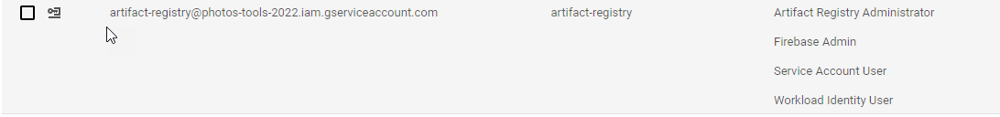

# Artifact Registry Continuous Deployment

Integrating with GitHub was rough.

The most important document was [GitHub's README](https://github.com/google-github-actions/auth#setting-up-workload-identity-federation)

Follow that sucker to the letter.

See 

## Scripts

```bash
gcloud iam service-accounts add-iam-policy-binding "artifact-registry@photos-tools-2022.iam.gserviceaccount.com" \
  --project="photos-tools-2022" \
  --role="roles/iam.workloadIdentityUser" \
  --member="principalSet://iam.googleapis.com/projects/550579950350/locations/global/workloadIdentityPools/github/attribute.repository/deltaepsilon/jupiter"
```

```bash
  gcloud iam workload-identity-pools providers describe "github-provider-id" \
  --project="photos-tools-2022" \
  --location="global" \
  --workload-identity-pool="github" \
  --format="value(name)"
```